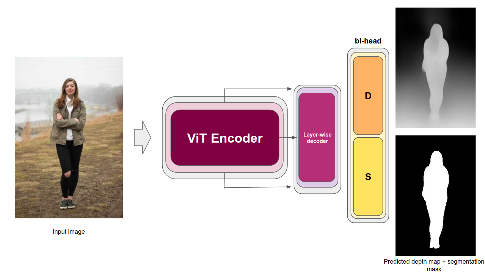

# Focus On Depth - A single DPT encoder for AutoFocus application and Dense Prediction Tasks


<!--  -->

<p align="center">
  
</p>

<!-- > Input image taken from: https://koboguide.com/how-to-improve-portrait-photography/ -->

## Abstract

<!-- Recent works have shown that in the real world, humans
rely on the image obtained by their left and right eyes in order to estimate depths of surrounding objects. Thus, -->
> Depth estimation is a classic task in computer vision, which is of
great significance for many applications such as augmented
reality, target tracking and autonomous driving. We firstly
summarize the deep learning models for monocular depth
estimation. Secondly, we will implement a recent Vision
Transformers based architecture for this task. We will seek
to improve it by adding a segmentation head in order to
perform multi-task learning using a customly built dataset.
Thirdly, we will implement our model for in-the-wild images (i.e. without control on the environment, the distance
and size of objects of interests, and their physical properties
(rotation, dynamics, etc.)) for Auto-focus application on
humans and will give qualitative comparison across other
methods.

## :zap: New! Web demo

You can check the webdemo hosted on Hugging Face and powered by Gradio, [here](https://huggingface.co/spaces/ybelkada/FocusOnDepth).

## :pushpin: Requirements

Run: ``` pip install -r requirements.txt ```

## :rocket: Running the model

You can first download one of the models from the model zoo:

### :bank: Model zoo

Get the links of the following models:

+ [```FocusOnDepth_vit_base_patch16_384.p```](https://drive.google.com/file/d/1Q7I777FW_dz5p5UlMsD6aktWQ1eyR1vN/view?usp=sharing)
+ Other models coming soon...

And put the ```.p``` file into the directory ```models/```. After that, you need to update the ```config.json``` ([Tutorial here](https://github.com/antocad/FocusOnDepth/wiki/Config-Wiki)) according to the pre-trained model you have chosen to run the predictions (this means that if you load a depth-only model, then you have to set ```type``` to ```depth``` for example ...).

### :dart: Run a prediction

Put your input images (that have to be ```.png``` or ```.jpg```) into the ```input/``` folder. Then, just run ```python run.py``` and you should get the depth maps as well as the segmentation masks in the ```output/``` folder.


## :hammer: Training

### :wrench: Build the dataset

Our model is trained on a combination of
+ [inria movie 3d dataset](https://www.di.ens.fr/willow/research/stereoseg/) | [view on Kaggle](https://www.kaggle.com/antocad/inria-fod/)
+ [NYU2 Dataset](https://cs.nyu.edu/~silberman/datasets/nyu_depth_v2.html) | [view on Kaggle](https://www.kaggle.com/antocad/nyuv2-fod)
+ [PoseTrack](https://posetrack.net/) | [view on Kaggle](https://www.kaggle.com/antocad/posetrack-fod)

### :pencil: Configure ```config.json```

Please refer to our [config wiki](https://github.com/antocad/FocusOnDepth/wiki/Config-Wiki) to understand how to modify the config file to run a training.

### :nut_and_bolt: Run the training script
After that, you can simply run the training script: ```python train.py```


## :scroll: Citations

Our work is based on the work from Ranflt et al. please do not forget to cite their work! :)
You can also check our [report](https://github.com/antocad/FocusOnDepth/blob/master/FocusOnDepth.pdf) if you need more details.

```
@article{DPT,
  author    = {Ren{\'{e}} Ranftl and
               Alexey Bochkovskiy and
               Vladlen Koltun},
  title     = {Vision Transformers for Dense Prediction},
  journal   = {CoRR},
  volume    = {abs/2103.13413},
  year      = {2021},
  url       = {https://arxiv.org/abs/2103.13413},
  eprinttype = {arXiv},
  eprint    = {2103.13413},
  timestamp = {Wed, 07 Apr 2021 15:31:46 +0200},
  biburl    = {https://dblp.org/rec/journals/corr/abs-2103-13413.bib},
  bibsource = {dblp computer science bibliography, https://dblp.org}
}
```
